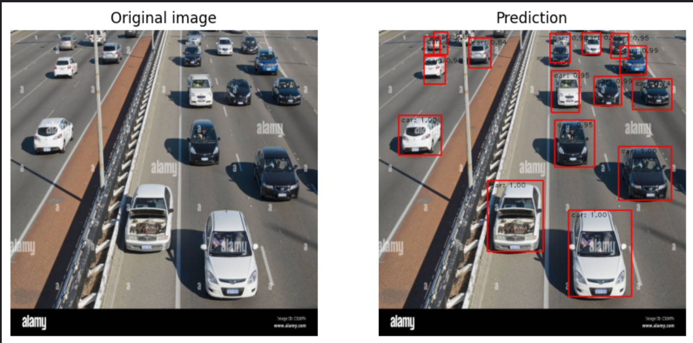
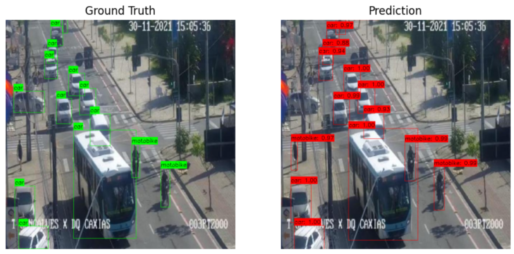
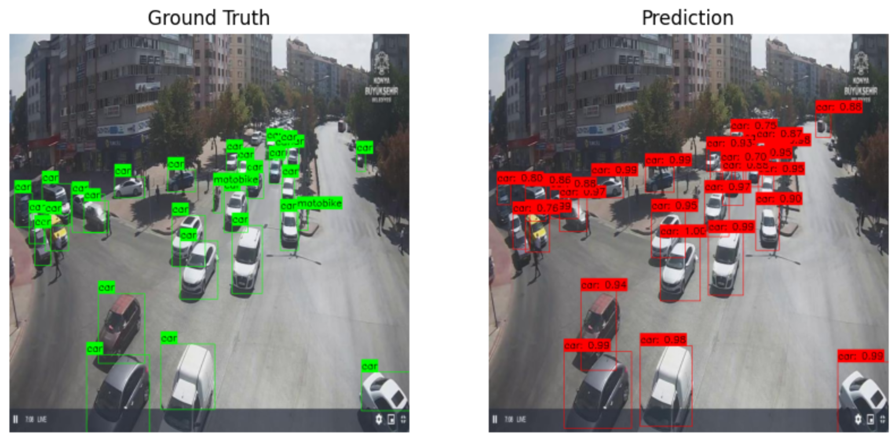
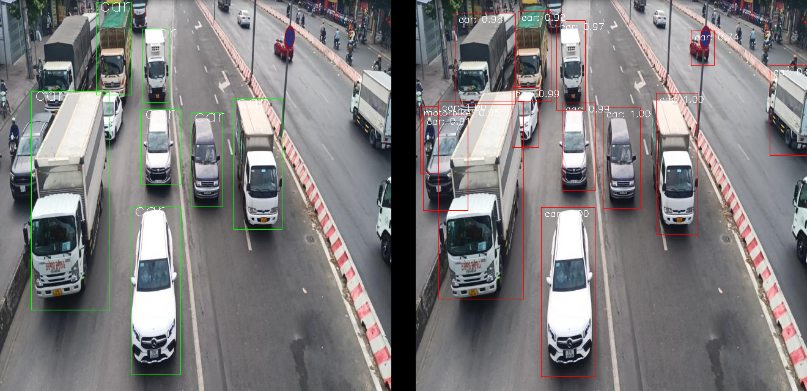
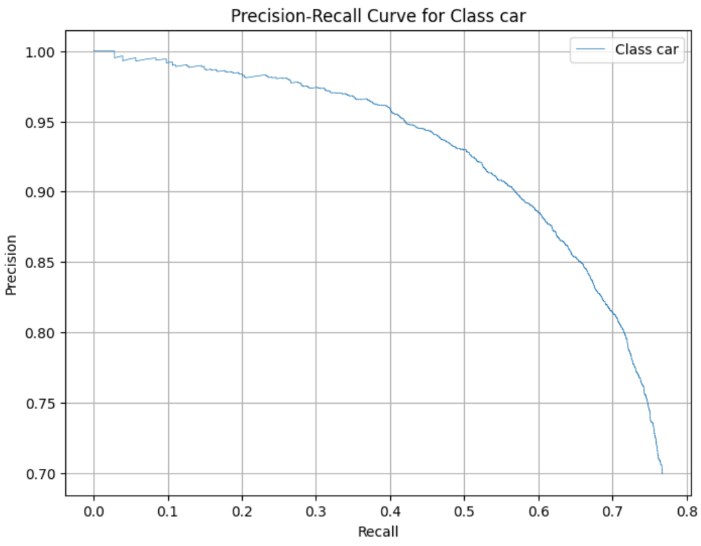
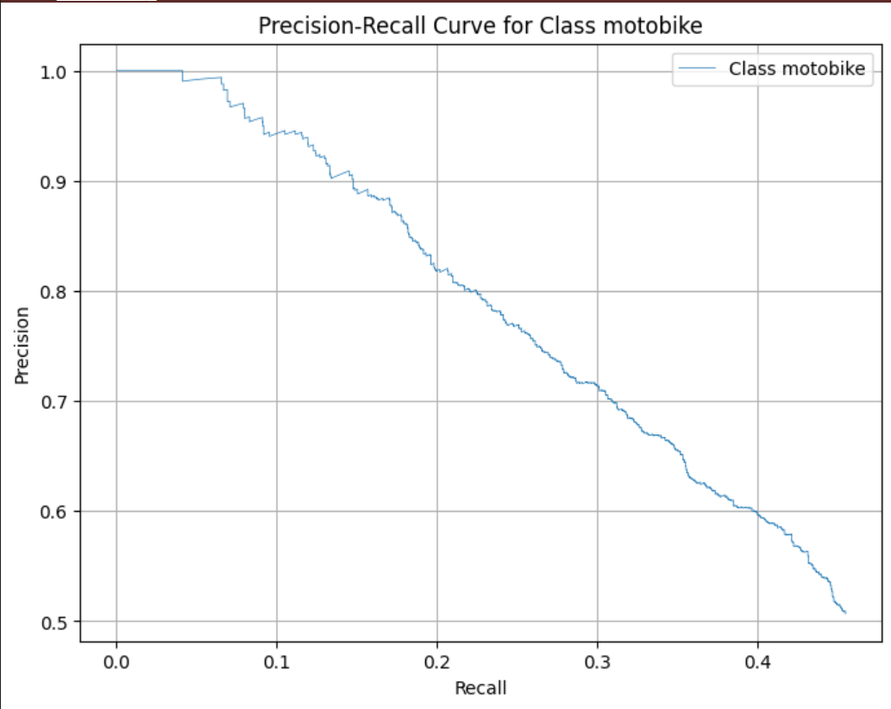

# Faster R-CNN for Car and Motorbike Detection

## Introduction

This repository contains an implementation of Faster R-CNN from scratch for the task of car and motorbike detection. Faster R-CNN is a state-of-the-art object detection model that improves object detection performance through its Region Proposal Network (RPN) and RoI pooling layers. This implementation aims to train a model to accurately detect and classify cars and motorbikes in images, achieving high performance on the detection task.

## Features

- **Custom Implementation**: A complete implementation of Faster R-CNN, including backbone networks, RPN, RoI pooling, and detection heads.
- **Dataset Support**: Integration with datasets containing car and motorbike images.
- **Training and Evaluation**: Scripts for training the model and evaluating its performance on validation data, including loss recording, mAP, and AP for each class.
- **Performance Improvement**: Techniques to enhance model performance, such as data augmentation and hyperparameter tuning.
- **Visualization**: Scripts to display results including annotated images and performance metrics.

## Requirements

- Python 3.x
- PyTorch 1.x or later
- torchvision
- OpenCV
- numpy
- matplotlib

You can install the required packages using pip:


## Result and metric
### Result
result




PRECISION RECALL CURVE
CAR

MOTORBIKE



## Evaluation Results

| Metric         | Value |
|----------------|-------|
| mAP @ 0.5      | 0.53  |
| mAP @ 0.5:0.95 | 0.68  |
| AP (Car) @ 0.5 | 0.80  |
| AP (Motorbike) @ 0.5 | 0.70  |

### Metric 

# Project Structure

The project structure is as follows:

 
    Object_detection/
    ├── dataset/
    │   ├── dataset_folder/
    │           ├── train
    │           ├── test
    │           ├── valid
    │   
    ├── output/
    │   ├── checkpoints/
    │   ├── logs/
    │   └── results/
    ├── src/
    │   ├── rpn_layer.py
    │   ├── dataset.py
    │   ├── infer.py
    │   ├── train.py
    │   ├── evaluate.py
    │   ├── load_data.py
    │   └──  config.yaml
    │ 
    ├── requirements.txt
    └── README.md
```bash
pip install -r requirements.txt


