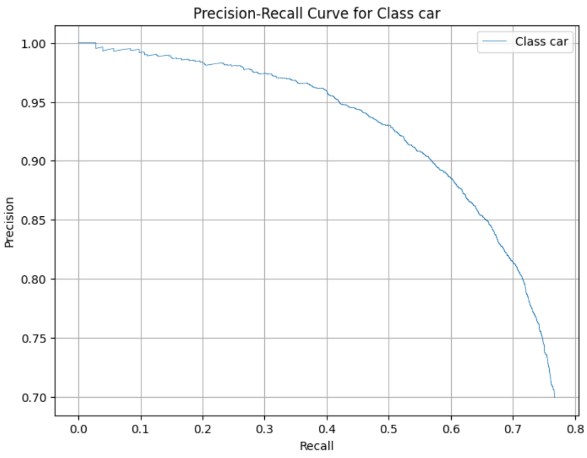
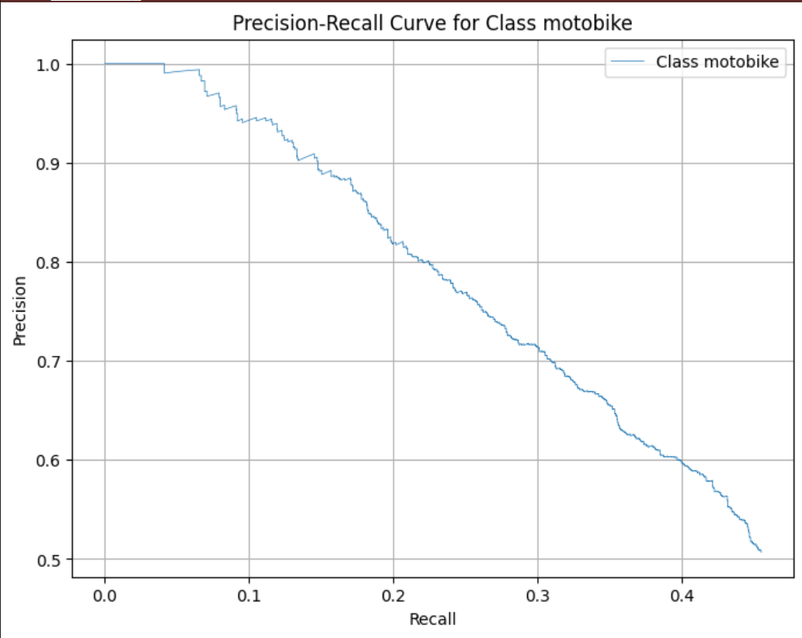

# Faster R-CNN for Car and Motorbike Detection

## Introduction

This repository contains an implementation of Faster R-CNN from scratch for the task of car and motorbike detection. 
Faster R-CNN is a state-of-the-art object detection model that improves object detection performance through its Region Proposal Network (RPN) and RoI pooling layers.
This implementation aims to train a model to accurately detect and classify cars and motorbikes in images, achieving quite good performance on the detection task.

## Features

- **Custom Implementation**: A complete implementation of Faster R-CNN, including backbone networks, RPN, RoI pooling.
- **Dataset Support**: Integration with datasets containing car and motorbike images.
- **Training and Evaluation**: Scripts for training the model and evaluating its performance on validation data, including loss recording, mAP, and AP for each class.
- **Performance Improvement**: Techniques to enhance model performance, such as data augmentation and hyperparameter tuning.
- **Visualization**: Scripts to display results including annotated images and performance metrics.

## Requirements

- Python 3.12.3
- PyTorch 2.1 or later
- torchvision
- OpenCV
- numpy
- matplotlib
- cv2

## Result 

Result

PRECISION RECALL CURVE

## Evaluation Results

### Metric 

| Iou threshold | map  |
|---------------|------|
| 0.5           | 0.53 |
| 0.55          | 0.50 |
| 0.6           | 0.43 |
| 0.65          | 0.38 |
| 0.7           | 0.32 |
| 0.75          | 0.25 |
| 0.85          | 0.18 |
| 0.9           | 0.12 |

Average precision for iou_threshold 0.5

| class     | A Precision |
|-----------|-------------|
| car       | 0.69        |
| motorbike | 0.37        |

## Project Structure

The project structure is as follows:

 
    Object_detection/
    ├── dataset/
    │   ├── dataset_folder/
    │           ├── train
    │           ├── test
    │           ├── valid
    │   
    ├── output/
    │   ├── checkpoints/
    │   ├── logs/
    │   └── results/
    ├── src/
    │   ├── rpn_layer.py
    │   ├── dataset.py
    │   ├── infer.py
    │   ├── train.py
    │   ├── evaluate.py
    │   ├── load_data.py
    │   └── config.yaml
    │ 
    ├── requirements.txt
    └── README.md

## Checkpoints
You can download the model from:

[**Download**](https://drive.google.com/file/d/1LwmhWWgi7xdaZdveMCmsP6rC-reFGTyM/view?usp=sharing)

## Dataset for train
I utilize several datasets of cars and motorcycles 
from around the world to train the model.
You can download these datasets from this link.
There are a total of five datasets available, 
each organized with the following directory structure:

    dataset_folder/
    │      ├── train
    │      │    ├── list images
    │      │    ├── annotation_file
    │      ├── test
    │      │    ├── list images
    │      │    ├── annotation_file
    │      ├── valid
    │      │    ├── list images
    │      │    ├── annotation_file

[**Dataset 1**](https://universe.roboflow.com/car-classification/vn_vehicle_2)
[**Dataset 2**](https://universe.roboflow.com/highway-traffic/road-traffic-4)
[**Dataset 3**](https://universe.roboflow.com/car-classification/vietnamese-vehicle)
[**Dataset 4**](https://universe.roboflow.com/fsmvu/street-view-gdogo)
[**Dataset 5**](https://universe.roboflow.com/project-tdxxb/cctv_car_bike_detection-fhqk8)

